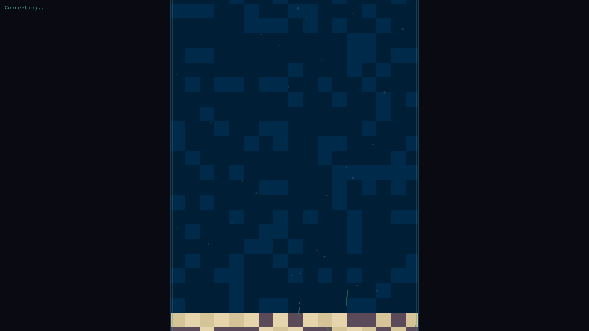

# The Idle Reef 🪸

**The aquarium for your processes. Runs in Chrome.**

Watch your terminal processes swim around like marine life in an idle game. The Idle Reef transforms boring process lists into an ambient, interactive 2D underwater visualization.

  

<p align="center">
  
</p>

## Features

- **Real-time visualization** of tmux sessions, panes, and Docker containers
- **Distinct marine life**: Jellyfish (sessions), Fish (panes), Whales (containers)
- **Click-to-interact**: View real-time logs, kill processes, see detailed stats
- **The Predator**: Dramatic shark animation when killing processes
- **Health monitoring**: Visual indicators for container health status
- **Stale detection**: Frozen bubble trap animation for inactive processes
- **Ambient Experience**: Seaweed, bubbles, and deep ocean vibes
- **4 Zelda-inspired soundtracks**: Jabu-Jabu, Lost Woods, Temple of Time, Fairy Fountain
- **Full audio control**: Toggle music, switch tracks, or mute all sounds
- **Sound effects**: Audio cues for spawns, kills, errors, and state changes
- **Vertical layout**: Optimized for portrait/fishtank monitor orientation

## Quick Start

```bash
# Clone the repo
git clone https://github.com/chrisrijos/idle-realm.git
cd idle-realm

# Install dependencies
npm install

# Start the server
npm run dev

# Open in browser
open http://localhost:3000
```

## Requirements

- Node.js 18+
- tmux (optional - for tmux process monitoring)
- Docker (optional - for container monitoring)

## Usage

### Keyboard & Mouse

| Action | Effect |
|--------|--------|
| Click sprite | Open context menu |
| Click track name | Cycle through soundtracks |
| Click `)))` button | Mute/unmute all audio |
| Click ♪ button | Toggle ambient music |
| Click outside menu | Close menu |

### Context Menu Options

- **View Logs**: See live-updating process output
- **Kill Process**: Stop container or kill tmux session/pane
- **Close**: Dismiss the menu

### Marine Life Types

| Sprite | Process Type | Color |
|--------|--------------|-------|
| 🎐 Jellyfish | tmux session | Lavender (Glowing) |
| 🐠 Fish | tmux pane | Orange (Clownfish) |
| 🐋 Whale | Docker (running) | Blue/Green |
| 🌫️ Gray Whale | Docker (stopped) | Gray |
| 🫧 Bubble Trap | Stale/inactive | Frozen Blue |

### Visual Indicators

- **Green dot**: Healthy container
- **Red dot**: Unhealthy container
- **Port dots**: Exposed ports (bottom of whale)
- **Ice ring**: Stale/frozen process
- **Bubbles**: Ambient background effects

## Configuration

The server runs on port 3001 (WebSocket + API) and the frontend on port 3000.

```javascript
// vite.config.js - change ports if needed
server: {
  port: 3000
}
```

## API Endpoints

| Endpoint | Method | Description |
|----------|--------|-------------|
| `/api/logs` | GET | Get process logs |
| `/api/kill` | POST | Kill a process |
| `ws://localhost:3001` | WebSocket | Real-time process updates |

## Architecture

```
┌─────────────────────────────────────┐
│  Browser (PixiJS)                   │
│  • 2D sprite rendering              │
│  • WebSocket client                 │
│  • Audio (Web Audio API)            │
└──────────────┬──────────────────────┘
               │ WebSocket
┌──────────────┴──────────────────────┐
│  Node.js Server                     │
│  • Express + ws                     │
│  • tmux CLI polling                 │
│  • Docker CLI polling               │
│  • REST API for logs/kill           │
└─────────────────────────────────────┘
```

## Tech Stack

- **Frontend**: PixiJS 8, Vite, Web Audio API
- **Backend**: Node.js, Express, ws (WebSocket)
- **Data**: tmux CLI, Docker CLI

## Development

```bash
# Run in development mode (hot reload)
npm run dev

# Run server only
npm run server

# Run client only
npm run client

# Build for production
npm run build
```

## Roadmap

- [ ] Kubernetes pod support
- [ ] Process CPU/memory graphs
- [ ] Custom themes
- [ ] Plugin system for other process types
- [ ] Multi-monitor support

## Contributing

Contributions welcome! Please read the contributing guidelines first.

1. Fork the repo
2. Create a feature branch (`git checkout -b feature/amazing`)
3. Commit changes (`git commit -m 'Add amazing feature'`)
4. Push to branch (`git push origin feature/amazing`)
5. Open a Pull Request

## License

MIT License - see [LICENSE](LICENSE) for details.

## Author

**Chris Rijos** - [@chrisrijos](https://github.com/chrisrijos)

---

*The aquarium for your processes. Made with 🐟 for developers who like to watch their processes swim.*
